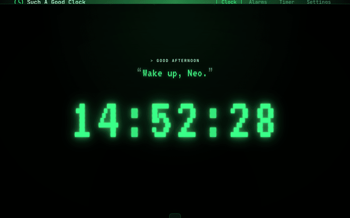
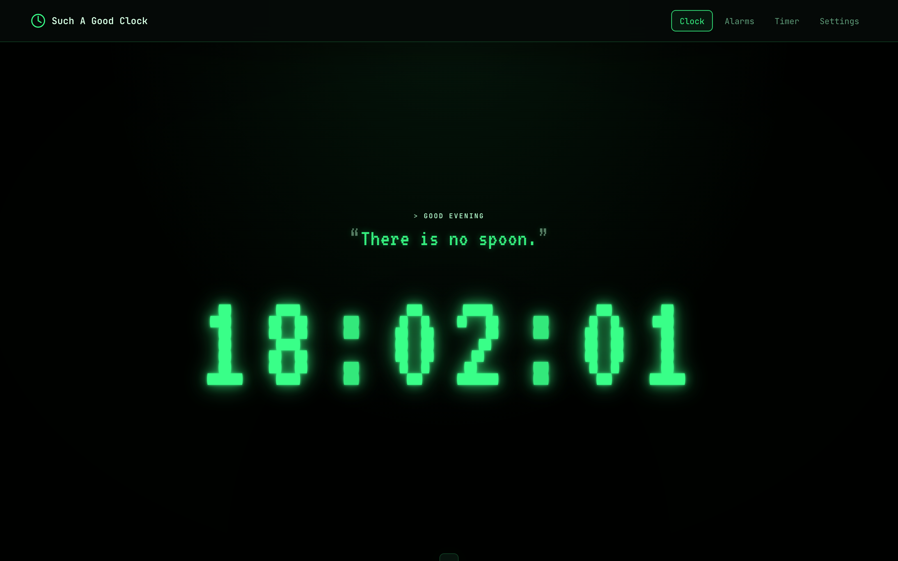
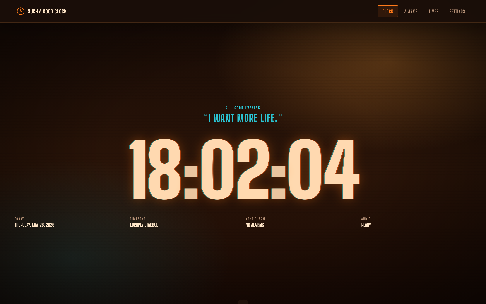
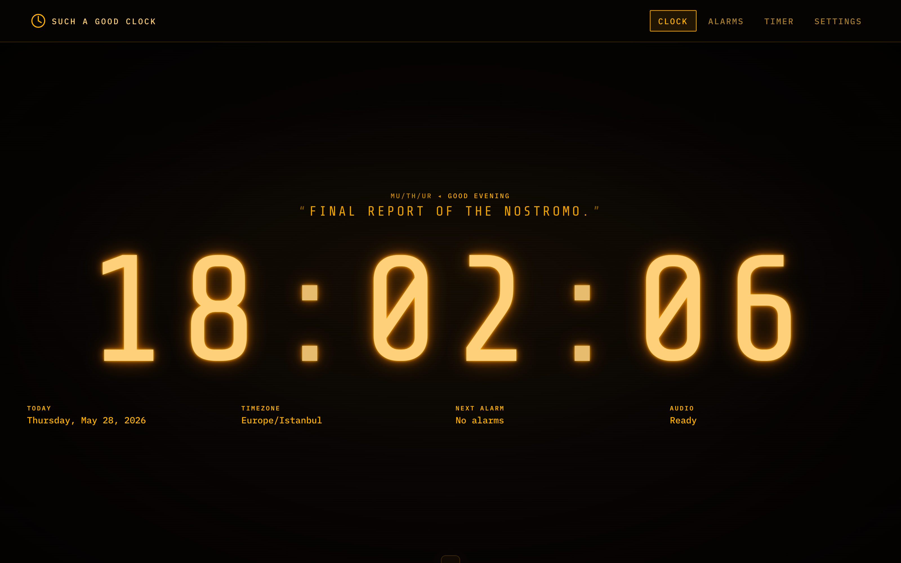
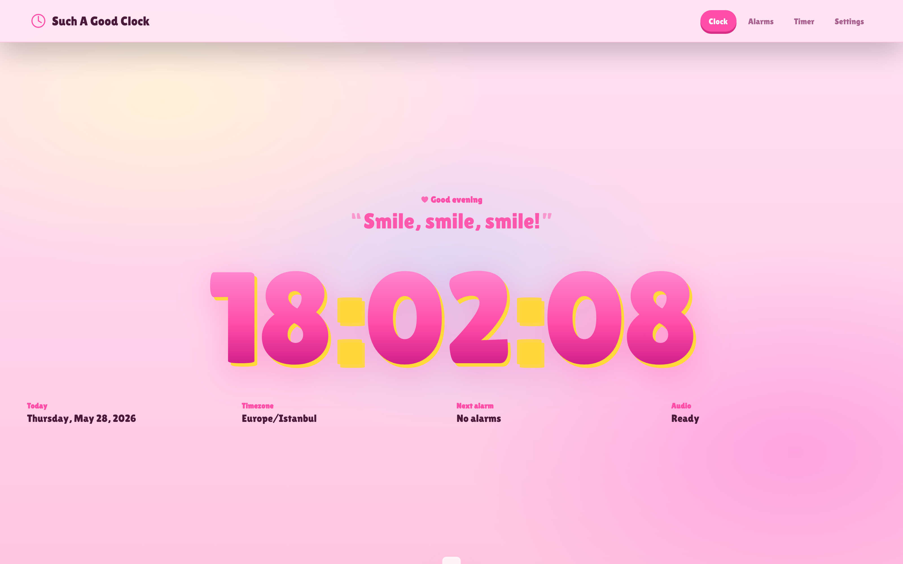
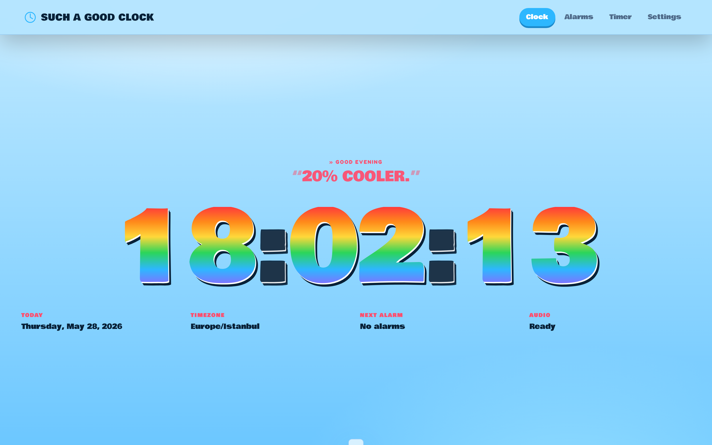
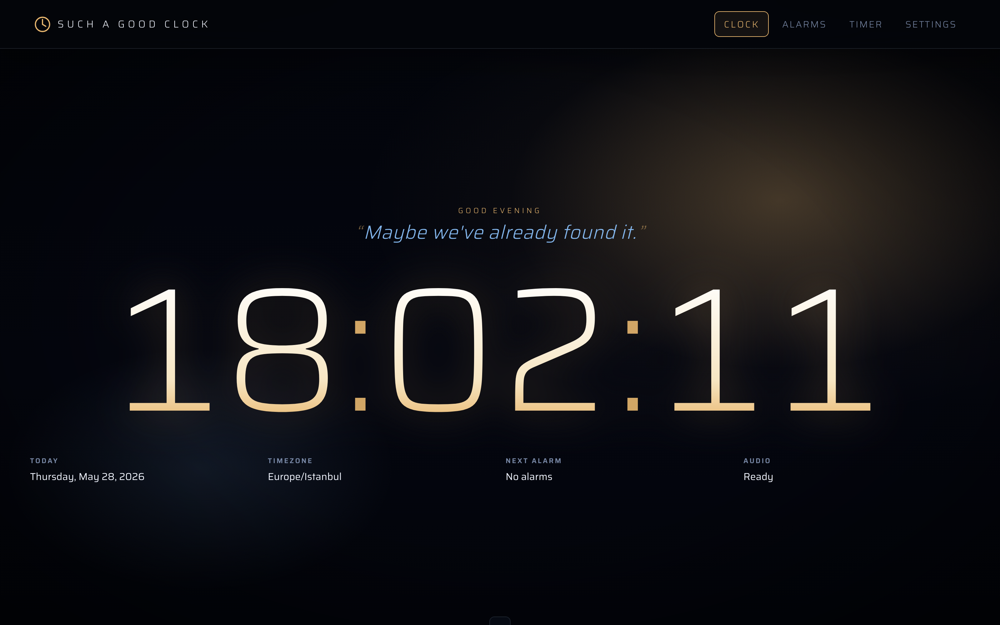
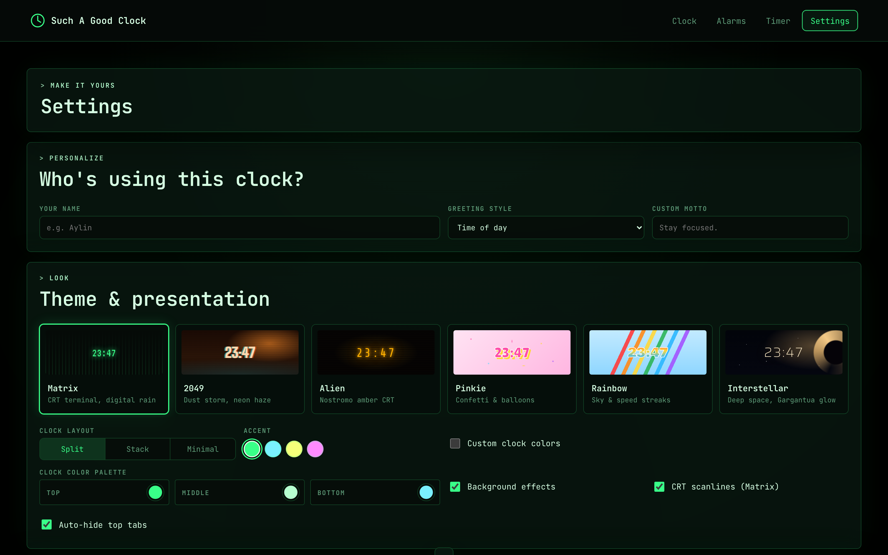
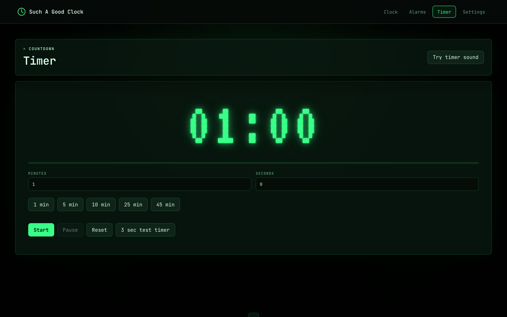
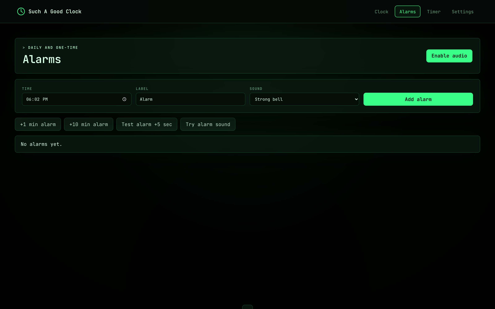

# Such A Good Clock

[](https://nazmiefearmutcu.github.io/such-a-good-clock/)
[](https://github.com/nazmiefearmutcu/such-a-good-clock/releases)
[](LICENSE)
[](https://github.com/nazmiefearmutcu/such-a-good-clock/actions/workflows/desktop-build.yml)
[](https://github.com/nazmiefearmutcu/such-a-good-clock/stargazers)

**A clock you'd actually want fullscreen on a spare monitor.** Six cinematic themes, alarms, countdown timers, custom three-color clock styling, Web Audio alerts. Runs as a browser PWA (offline-capable) or as a native macOS / Windows / Linux desktop app.

## Preview

> Live demo: **https://nazmiefearmutcu.github.io/such-a-good-clock/**



### Cinematic themes

#### Matrix


#### 2049 (Blade Runner 2049)


#### Alien (Nostromo amber CRT)


#### Pinkie


#### Rainbow


#### Interstellar


### Functional surfaces

#### Theme studio


#### Timer


#### Alarms


Such A Good Clock opens directly into a polished Matrix-inspired clock by default: split layout, live seconds, steady colon, full-volume Web Audio, auto-hiding top tabs, background effects, and CRT scanlines. From there, users can switch between six cinematic themes (above), tune the clock with a three-color palette, save personal greetings, set alarms, and run countdown timers in the browser or as a native desktop app.

## Features

- Full-width digital clock with local date, timezone, and saved display preferences.
- Clock, Alarms, Timer, and Settings pages.
- Six visual themes: Matrix, 2049, Alien, Pinkie, Rainbow, and Interstellar.
- Theme cards with live previews, cinematic backgrounds, and rotating theme-specific quote lines.
- Custom three-stop clock color palette with separate top, middle, and bottom color controls.
- Personal greeting controls with name, time-based greetings, custom motto, or a clean no-greeting mode.
- Daily alarms plus quick one-time alarms for +1 minute, +10 minutes, and +5 second testing.
- Alarm popup follows the user across pages and supports stop plus 5 minute snooze.
- Countdown timer with a 3 second test flow.
- Web Audio alarm and timer sounds generated in-app with volume, mute, and sound selection.
- localStorage persistence for alarms and settings.
- Installable app shortcut support through a web app manifest and service worker.
- Static GitHub Pages-ready deployment: no build step required.

## Open

Use the live app:

```text
https://nazmiefearmutcu.github.io/such-a-good-clock/
```

On supported desktop and mobile browsers, use the browser's install option to add Such A Good Clock as an app shortcut.

## Native Apps

The repository includes an Electron desktop shell that packages the same Such A Good Clock web app as a native desktop application.

Open the installed macOS app:

```bash
open "/Applications/Such A Good Clock.app"
```

Run the native app locally:

```bash
npm run desktop:run
```

Build desktop packages:

```bash
npm run desktop:build:mac
npm run desktop:build:win
npm run desktop:build:linux
```

Each build writes installers or archives to `dist-native/`. The GitHub Actions workflow builds macOS, Windows, and Linux artifacts on their matching runners.

## Run

```bash
python3 -m http.server 4173
```

Then open:

```text
http://127.0.0.1:4173
```

## Test

```bash
npm install
npm run test:e2e
```

The automated test verifies the custom clock color palette, checks all themes for clock fit, switches to the Interstellar theme, verifies quote cycling and logo-to-home navigation, creates one alarm and one timer, verifies that both trigger Web Audio sound events, and writes a screenshot to `test-results/such-a-good-clock-e2e.png`.

Current manual and automated coverage is tracked in `TEST_PLAN.md`.
